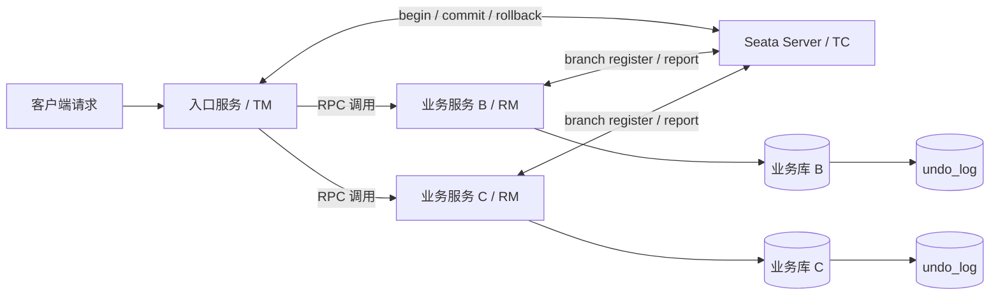
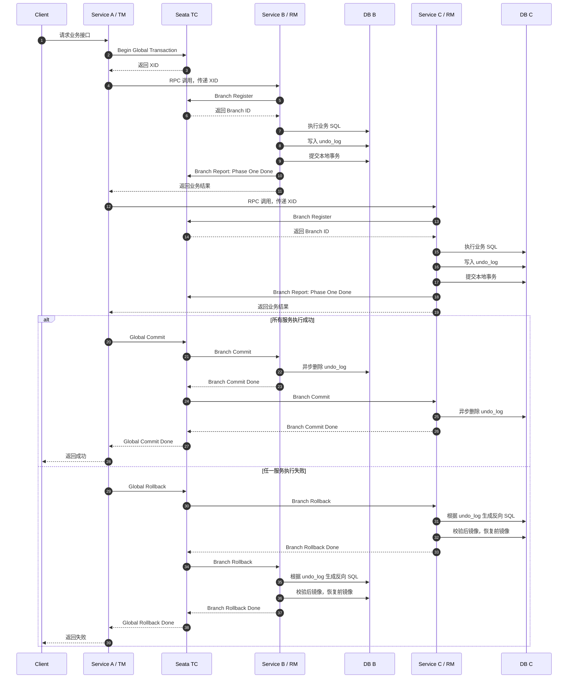
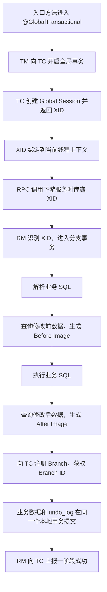
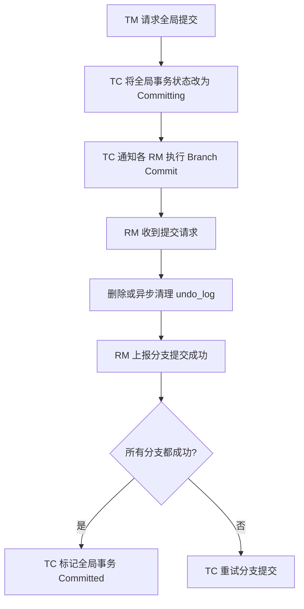
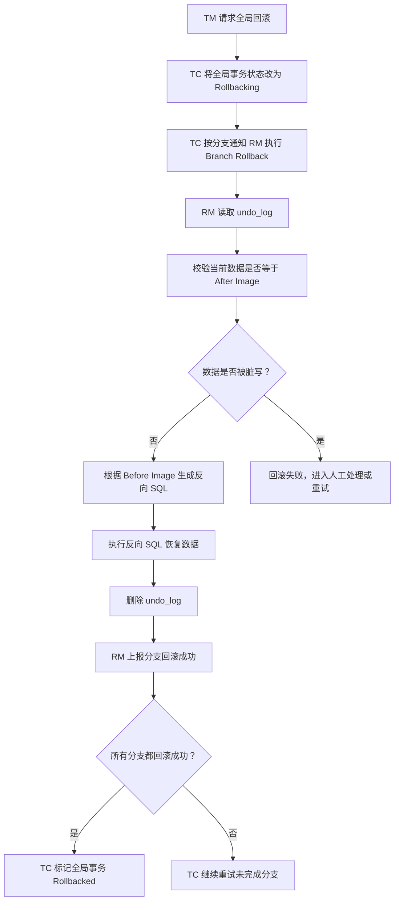
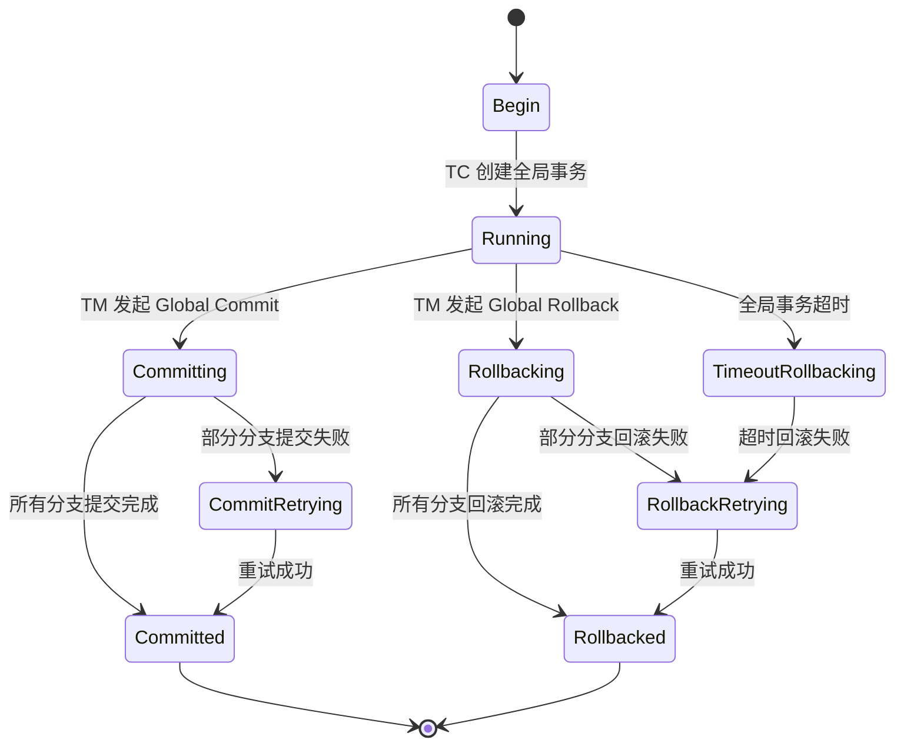

# Seata 整体执行流程

## 1. 核心角色

Seata 主要由三个角色协同完成分布式事务：

| 角色 | 全称 | 职责 |
| --- | --- | --- |
| TC | Transaction Coordinator | 事务协调器，维护全局事务和分支事务状态，驱动全局提交或回滚 |
| TM | Transaction Manager | 事务管理器，定义全局事务边界，负责开启、提交、回滚全局事务 |
| RM | Resource Manager | 资源管理器，管理分支事务资源，负责分支注册、状态上报、分支提交或回滚 |

在 Spring Cloud / Dubbo / Feign 场景中，一般由入口服务的 `@GlobalTransactional` 触发 TM 行为，各业务服务的数据源代理承担 RM 行为。

---

## 2. 整体架构图



说明：

* 入口服务开启全局事务后，会从 TC 获取全局事务 ID，也就是 `XID`。
* `XID` 会随着 RPC 调用传递到下游服务。
* 每个访问数据库的服务都会作为 RM 向 TC 注册分支事务。
* AT 模式下，每个业务库都需要有 `undo_log` 表，用于全局回滚时恢复数据。

---

## 3. AT 模式完整执行时序



---

## 4. 一阶段执行流程



一阶段的关键点：

* 业务 SQL 和 `undo_log` 必须在同一个本地事务中提交。
* 一阶段本地事务已经提交，所以全局事务提交时性能较好。
* 回滚依赖 `undo_log`，因此业务库必须正确初始化 `undo_log` 表。
* 如果 SQL 过于复杂或不支持镜像生成，AT 模式可能无法自动回滚，需要改造 SQL 或换事务模式。

---

## 5. 二阶段提交流程



AT 模式下，全局提交很轻量，因为一阶段本地事务已经提交成功。二阶段提交主要是删除 `undo_log`，通常可以异步完成。

---

## 6. 二阶段回滚流程



回滚的关键点：

* `Before Image` 表示业务 SQL 执行前的数据。
* `After Image` 表示业务 SQL 执行后的数据。
* 回滚前会校验当前数据是否仍然等于 `After Image`。
* 如果当前数据已经被其他事务改过，就可能出现脏写，Seata 会避免直接覆盖，通常需要重试或人工处理。

---

## 7. 全局事务状态流转



---

## 8. 一次典型业务调用示例

以下以“创建订单、扣库存、扣余额”为例：

```text
订单服务 OrderService
  @GlobalTransactional
  1. 创建订单
  2. 调用库存服务扣减库存
  3. 调用账户服务扣减余额
  4. 全部成功后提交全局事务

库存服务 StorageService
  1. 接收 XID
  2. 注册库存分支事务
  3. 执行 update storage set count = count - ?
  4. 写 undo_log
  5. 提交本地事务

账户服务 AccountService
  1. 接收 XID
  2. 注册账户分支事务
  3. 执行 update account set balance = balance - ?
  4. 写 undo_log
  5. 提交本地事务
```

如果账户服务扣余额失败：

```text
1. 账户服务抛异常
2. 异常返回订单服务
3. TM 通知 TC 全局回滚
4. TC 通知库存服务回滚库存分支
5. TC 通知订单服务回滚订单分支
6. 各 RM 根据 undo_log 恢复数据
7. TC 标记全局事务回滚完成
```

---

## 9. 常见问题

### 9.1 为什么 AT 模式提交快？

因为一阶段已经提交了本地事务，二阶段提交只需要清理 `undo_log`。这也是 AT 模式相比传统 XA 更适合高并发业务场景的原因之一。

### 9.2 为什么需要 undo_log？

AT 模式没有长时间持有数据库事务锁，而是通过 `undo_log` 保存回滚所需的前后镜像。全局回滚时，RM 根据 `undo_log` 把数据恢复到业务 SQL 执行前。

### 9.3 XID 有什么作用？

`XID` 是全局事务上下文。它把入口服务、下游服务、分支事务和 TC 中的全局会话串起来。没有正确传递 `XID`，下游服务就不会加入同一个全局事务。

### 9.4 Seata 和本地事务是什么关系？

Seata 不替代本地事务。每个分支仍然依赖数据库本地事务保证业务 SQL 和 `undo_log` 的原子性。Seata 负责在多个本地事务之间协调全局一致性。

### 9.5 哪些情况要谨慎使用 AT 模式？

* 复杂 SQL 无法生成准确前后镜像。
* 大事务中修改数据量很大，导致 `undo_log` 膨胀。
* 存在大量热点行更新，容易产生全局锁竞争。
* 业务允许长事务或强一致锁定时，可能需要评估 XA。
* 业务流程很长且涉及人工节点时，更适合 Saga。

---

## 10. 面试版总结

Seata 的核心流程可以概括为：

```text
TM 开启全局事务
  -> TC 生成 XID
  -> XID 随 RPC 传播
  -> RM 注册分支事务
  -> RM 执行业务 SQL 并写 undo_log
  -> RM 提交本地事务
  -> TM 通知 TC 全局提交或回滚
  -> TC 协调各 RM 执行二阶段提交或回滚
```

AT 模式的本质是：

> 一阶段提交本地事务并记录回滚日志，二阶段由 TC 协调提交清理或根据 `undo_log` 反向补偿回滚。
