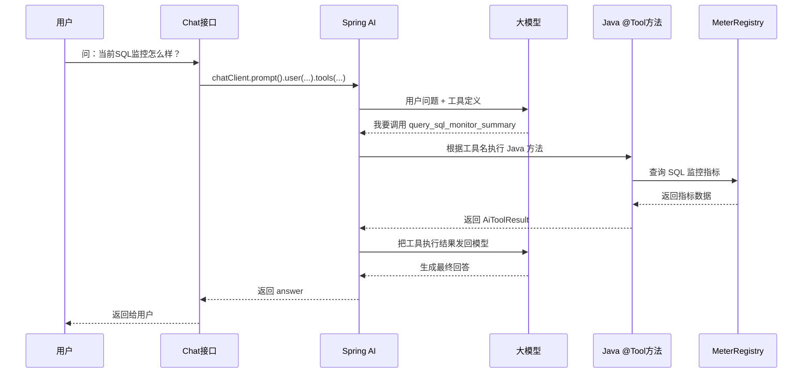

你面试时可以这样讲，核心一句话：

**大模型不认识 Java 函数，它只认识 Spring AI 发过去的“工具说明”。模型负责判断要不要调用工具；Spring AI 负责把工具说明发给模型、解析模型返回的 tool call、执行 Java 方法、再把结果发回模型。**

**职责划分**

| 环节 | 谁负责 |
|---|---|
| 把 `@Tool` Java 方法转换成工具定义 | Spring AI |
| 把用户消息 + 工具定义发给模型 | Spring AI |
| 判断是否需要调用函数 | 大模型 |
| 返回要调用的工具名和参数 | 大模型 |
| 根据工具名找到 Java 方法 | Spring AI |
| 执行 Java 方法 | Spring Boot 应用 |
| 把函数结果再发给模型 | Spring AI |
| 根据函数结果组织最终回答 | 大模型 |

你现在代码里虽然只看到一个 chat 接口：

```java
chatClient.prompt()
        .user(request.message())
        .tools(sqlMonitorAiTools)
        .toolContext(Map.of("category", "ai"))
        .call()
        .content();
```

但 `.tools(sqlMonitorAiTools)` 是关键。

它会把这个方法：

```java
@Tool(
    name = "query_sql_monitor_summary",
    description = "Query SQL monitor metrics summary..."
)
public AiToolResult<SqlMonitorSummary> querySqlMonitorSummary(ToolContext context) {
    return AiToolResult.success(sqlMonitorQueryService.getSummary());
}
```

转换成类似这样的工具定义，随用户问题一起发给模型：

```json
{
  "name": "query_sql_monitor_summary",
  "description": "Query SQL monitor metrics summary, including SQL execute count, average cost, slow SQL count, error SQL count, and timeout SQL count.",
  "parameters": {
    "type": "object",
    "properties": {}
  }
}
```

所以模型收到的不是 Java 代码，而是：

```text
用户问题：
帮我看看当前 SQL 监控情况，有没有慢 SQL 或错误 SQL？

可用工具：
query_sql_monitor_summary：可以查询 SQL 监控摘要，包括执行次数、平均耗时、慢 SQL、错误 SQL、超时 SQL。
```

模型看到用户问的是 SQL 监控，再看到有一个工具正好能查 SQL 监控，于是返回：

```json
{
  "tool_call": {
    "name": "query_sql_monitor_summary",
    "arguments": {}
  }
}
```

然后 Spring AI 接管：

```text
模型返回 tool_call
  -> Spring AI 根据 name 找到本地 ToolCallback
  -> ToolCallback 对应 SqlMonitorAiTools.querySqlMonitorSummary()
  -> Spring AI 执行 Java 方法
  -> Java 方法读取 MeterRegistry 指标
  -> 返回 AiToolResult<SqlMonitorSummary>
```

函数结果大概是：

```json
{
  "success": true,
  "code": "OK",
  "message": "success",
  "data": {
    "category": "ai",
    "executeCount": 10,
    "averageCostMs": 120,
    "maxCostMs": 900,
    "slowSqlCount": 1,
    "errorSqlCount": 0,
    "timeoutSqlCount": 0
  }
}
```

Spring AI 会把这个工具执行结果再发回模型，相当于告诉模型：

```text
刚才你请求调用的 query_sql_monitor_summary 已经执行完了，结果如下：
executeCount=10
averageCostMs=120
slowSqlCount=1
errorSqlCount=0
timeoutSqlCount=0
```

然后模型基于这个结果生成最终自然语言：

```text
当前 SQL 执行 10 次，平均耗时 120ms，最大耗时 900ms。
发现 1 次慢 SQL，没有错误 SQL 和超时 SQL，整体风险较低。
```

完整流程可以这样画：



**面试版回答可以这样说**

> Spring AI Function Calling 不是模型直接调用 Java 方法。  
> 我们在 Java 里用 `@Tool` 声明一个工具，Spring AI 会把这个工具转换成模型能理解的 tool definition，包括工具名、描述和参数 schema。  
> 用户请求进来后，Spring AI 会把用户消息和可用工具定义一起发给大模型。大模型根据用户意图和工具描述判断是否需要调用工具。如果需要，它不会执行函数，而是返回一个 tool call，比如工具名和参数。  
> Spring AI 收到 tool call 后，会在本地的 ToolCallback 注册表里根据工具名找到对应的 Java 方法，通过反射或方法回调执行。执行结果再作为 tool result 发回大模型。大模型看到原始问题和工具结果后，再生成最终自然语言回答返回给用户。  
> 所以决策在模型，执行在 Spring Boot，编排在 Spring AI。

最关键的边界就是：

```text
大模型：判断是否调用工具，生成 tool call，生成最终回答
Spring AI：生成工具定义，维护 ToolCallback 映射，执行调用循环
Java 应用：真正执行函数，访问数据库、指标、外部系统
```

你代码里的入口虽然只有一个 chat 接口，但 `.tools(sqlMonitorAiTools)` 已经把函数能力“挂”到了这次对话里。大模型能不能调用，靠的就是 Spring AI 发过去的工具描述。