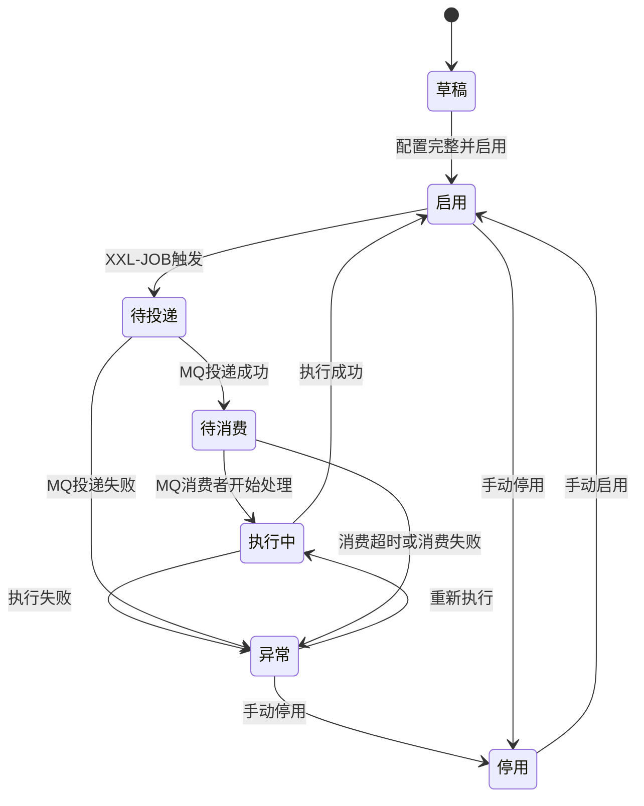

# 数据采集分析转换入库功能 PRD

## 1. 文档信息

| 项目 | 内容 |
| --- | --- |
| 文档名称 | 数据采集分析转换入库功能 PRD |
| 版本 | V1.0 |
| 适用系统 | 数据采集平台 / 后台管理系统 |
| 核心模块 | 模型管理、采集接口、采集任务、XXL-JOB 调度、MQ 任务分发、数据分析、数据转换、动态建表、数据入库 |
| 目标读者 | 产品、后端、前端、测试、运维、数据开发 |

## 2. 背景与问题

当前系统需要从外部 HTTP 接口、业务数据库、消息队列或第三方数据源中定时采集数据，并将采集到的数据经过结构解析、质量分析、字段转换、清洗校验后入库。若每个数据源都通过定制代码实现，会带来以下问题：

1. 接口接入成本高，每新增一个数据源都需要研发介入。
2. 数据结构不可配置，采集来源字段与业务表字段映射关系不透明。
3. 采集任务缺少统一调度、重试、日志和监控。
4. 数据入库前缺少质量分析，异常数据难以及时发现。
5. 数据转换逻辑分散在代码中，后期维护和排查成本高。

因此需要建设一套可配置的数据采集能力，将“模型、采集接口、采集任务、XXL-JOB 调度、MQ 任务分发、消费端采集执行”串联起来，形成从配置到调度、从异步执行到入库、从日志到分析的完整闭环。

## 3. 产品目标

### 3.1 核心目标

建设一个配置化的数据采集分析转换入库功能，使业务人员或数据配置人员可以通过后台完成以下动作：

1. 定义目标数据模型，包括字段、类型、是否必填、唯一键、入库表等。
2. 配置采集接口，并按采集方式区分 HTTP、DB、MQ 三类来源配置。
3. 创建采集任务，将模型与采集接口绑定，并配置调度周期、增量规则、重试策略和入库策略。
4. 通过 XXL-JOB 定时或手动触发采集任务，并将采集指令发送到内部 MQ。
5. 由 MQ 消费端执行真实采集，对采集结果进行数据质量分析、字段转换、校验清洗、去重和入库。
6. 基于模型配置生成或校验目标表结构，避免目标表结构长期硬编码。
7. 提供执行日志、异常明细、数据统计和任务监控。

### 3.2 业务价值

1. 降低新增数据源接入成本。
2. 提升数据采集任务的可配置性和可追踪性。
3. 统一任务调度、日志、重试和告警能力。
4. 提升入库数据质量，减少脏数据进入业务表。
5. 支持后续扩展更多数据源类型，如文件、对象存储、数据仓库等。

## 4. 范围说明

### 4.1 本期范围

| 模块 | 本期能力 |
| --- | --- |
| 模型管理 | 配置数据模型、字段定义、字段类型、必填、唯一键、目标表 |
| 采集接口 | 按采集方式配置 HTTP、DB、MQ 数据来源，支持连接测试、采集测试和响应解析 |
| 采集任务 | 绑定模型和接口，配置调度、增量参数、转换规则、目标表规则、入库策略 |
| XXL-JOB 调度 | 自动创建或绑定 XXL-JOB 任务，支持定时执行、手动执行、失败重试，并负责发送内部 MQ 任务消息 |
| MQ 任务分发 | 支持采集任务消息投递、消费、重试、追踪和执行状态回写 |
| 数据分析 | 统计采集总量、有效量、异常量、重复量、字段完整率 |
| 数据转换 | 支持字段映射、默认值、字典转换、类型转换、简单表达式 |
| 动态建表 | 根据模型字段生成目标表结构，支持 JdbcTemplate 执行 DDL |
| 数据入库 | 支持新增、覆盖、更新、忽略重复等入库策略 |
| 日志监控 | 执行记录、采集来源摘要、异常明细、入库结果、耗时统计 |

### 4.2 暂不包含

1. 文件类数据源，如 Excel、CSV、FTP 文件目录。
2. 复杂 ETL 编排，如多任务依赖、DAG 工作流。
3. MQ 实时流式消费，本期仅支持由调度触发的批量拉取或限量消费。
4. 可视化数据建模画布。
5. 复杂脚本转换能力，如完整 JavaScript / Python 脚本执行沙箱。

## 5. 关键概念

### 5.1 模型

模型是目标数据结构定义，用于描述采集数据最终要转换成什么样的数据。模型包含字段、字段类型、是否必填、唯一键、字段说明、目标入库表等信息。

示例：企业信息模型、商品信息模型、职位信息模型、订单信息模型。

### 5.2 采集接口

采集接口是数据来源配置，用于描述系统如何从外部来源获取数据。采集接口需要先选择采集方式，再展示对应的配置项。

本期支持三类采集方式：

| 采集方式 | 说明 | 典型场景 |
| --- | --- | --- |
| HTTP | 通过 HTTP / HTTPS API 拉取数据 | 第三方接口、内部服务接口 |
| DB | 通过数据库连接执行查询 SQL 拉取数据 | 业务库、数据中间库、只读报表库 |
| MQ | 通过消息队列 Topic / Queue 消费消息 | Kafka、RabbitMQ、RocketMQ 等消息来源 |

不同采集方式最终都需要输出统一的原始数据列表，后续进入同一套分析、转换、校验和入库流程。

### 5.3 采集任务

采集任务是一次可执行的数据采集配置。它将模型和采集接口关联起来，并配置调度周期、增量字段、转换规则、入库策略、失败重试等执行规则。

### 5.4 XXL-JOB

XXL-JOB 作为任务调度引擎，负责按照 Cron 表达式或手动触发采集任务。系统通过统一 JobHandler 接收 XXL-JOB 调度请求，查询采集任务配置，创建执行实例，并向内部 MQ 发送采集任务消息。

XXL-JOB 不直接承担完整采集、解析、转换和入库逻辑。真实执行逻辑由 MQ 消费端完成。

### 5.5 内部 MQ 任务分发

内部 MQ 是系统调度和执行之间的解耦层。XXL-JOB 触发后，将任务 ID、执行实例 ID、触发时间、增量参数、traceId 等信息封装为任务消息发送到 MQ。MQ 消费者接收消息后，再查询完整采集任务配置并执行采集链路。

内部 MQ 与“MQ 采集方式”需要区分：

| 类型 | 说明 |
| --- | --- |
| 内部 MQ 任务分发 | 系统内部用于分发采集任务，由 XXL-JOB 生产消息，采集消费者消费消息 |
| MQ 采集方式 | 外部数据来源是消息队列，系统从外部 Topic / Queue 中消费业务数据 |

### 5.6 模型目标表

模型目标表是采集数据最终入库的表。当前系统可通过 JdbcTemplate 执行 DDL 创建目标表，但表结构不应长期硬编码在业务代码中，应由模型字段配置驱动生成。

目标方向是将“模型字段配置 -> 表结构生成器 -> SQL 方言适配 -> JdbcTemplate 执行 DDL”拆分为清晰链路，使 JdbcTemplate 只负责执行 SQL，不负责决定表结构。

## 6. 用户角色

| 角色 | 权限与职责 |
| --- | --- |
| 系统管理员 | 管理数据源、模型、任务、权限、系统配置 |
| 数据配置人员 | 配置模型、采集接口、采集任务和转换规则 |
| 运维人员 | 查看 XXL-JOB 状态、任务日志、失败告警、执行耗时 |
| 业务查看人员 | 查看任务执行结果、数据质量分析和入库统计 |

## 7. 整体流程


## 8. 功能需求

### 8.1 模型管理

#### 8.1.1 模型列表

系统应提供模型列表页面，支持查看、搜索、新增、编辑、复制、停用和删除模型。

字段：

| 字段 | 说明 |
| --- | --- |
| 模型名称 | 用户可识别的模型名称 |
| 模型编码 | 系统唯一编码，用于任务配置和接口调用 |
| 目标表名 | 数据最终入库的业务表或中间表 |
| 状态 | 启用、停用 |
| 字段数 | 模型字段数量 |
| 创建人 | 创建模型的用户 |
| 更新时间 | 最近修改时间 |

#### 8.1.2 模型字段配置

每个模型支持配置多个字段。

字段属性：

| 属性 | 说明 |
| --- | --- |
| 字段名称 | 中文名称，如“企业名称” |
| 字段编码 | 英文字段名，如 company_name |
| 字段类型 | string、number、decimal、date、datetime、boolean、json |
| 是否必填 | 入库前是否必须有值 |
| 是否唯一键 | 用于去重和更新判断 |
| 默认值 | 当采集数据为空时使用 |
| 长度限制 | 字符串最大长度 |
| 格式规则 | 日期格式、数字精度等 |
| 字典映射 | 可选，关联字典转换规则 |

#### 8.1.3 模型校验规则

模型保存时需要校验：

1. 模型编码全局唯一。
2. 同一模型下字段编码唯一。
3. 至少配置一个字段。
4. 启用入库策略时必须配置目标表。
5. 如果入库策略包含更新或去重，必须至少配置一个唯一键字段。

### 8.2 采集接口管理

#### 8.2.1 接口基础配置

采集接口用于定义数据获取方式。用户创建采集接口时，必须先选择采集方式，系统根据采集方式展示对应配置项。

字段：

| 字段 | 说明 |
| --- | --- |
| 接口名称 | 用户可识别名称 |
| 接口编码 | 系统唯一编码 |
| 采集方式 | HTTP、DB、MQ |
| 数据来源名称 | 外部接口、数据库连接或消息队列来源名称 |
| 超时时间 | 单次请求、查询或消费的超时时间 |
| 单次最大采集量 | 防止单次任务拉取过多数据 |
| 状态 | 启用、停用 |

#### 8.2.2 HTTP 采集配置

当采集方式为 HTTP 时，系统展示 HTTP 专属配置。

| 字段 | 说明 |
| --- | --- |
| 请求地址 | HTTP / HTTPS URL |
| 请求方式 | GET、POST |
| Content-Type | application/json、form-data、x-www-form-urlencoded |
| 请求 Header | 支持静态 Header 和变量 Header |
| 鉴权方式 | 无、Token、Basic Auth、自定义 Header |
| 请求参数 | Query、Body、Header、Path 参数 |
| 分页方式 | 不分页、页码分页、游标分页 |
| 响应解析规则 | 成功状态、错误消息、数据列表路径、总数路径、游标路径 |
| 状态 | 启用、停用 |

HTTP 请求参数支持配置以下类型：

| 参数类型 | 说明 |
| --- | --- |
| Query 参数 | 拼接在 URL 后 |
| Body 参数 | POST 请求体参数 |
| Header 参数 | 请求头参数 |
| Path 参数 | URL 路径变量 |
| 系统变量 | 当前时间、上次成功时间、任务 ID、页码、分页大小 |

系统变量示例：

| 变量 | 说明 |
| --- | --- |
| ${currentTime} | 当前执行时间 |
| ${lastSuccessTime} | 任务上次成功执行时间 |
| ${pageNo} | 当前页码 |
| ${pageSize} | 每页数量 |
| ${taskId} | 当前采集任务 ID |

#### 8.2.3 DB 采集配置

当采集方式为 DB 时，系统通过数据库连接执行查询 SQL，并将查询结果作为原始数据列表。

| 字段 | 说明 |
| --- | --- |
| 数据库类型 | MySQL、PostgreSQL、ClickHouse、OnceBase 等，具体按系统支持范围配置 |
| 连接地址 | 数据库 Host、Port、Database |
| 用户名 | 数据库只读账号 |
| 密码 | 加密存储 |
| 连接参数 | 可选，如时区、编码、SSL 参数 |
| 查询 SQL | 只允许 SELECT 查询 |
| 增量条件 | 基于时间字段、自增 ID 或业务游标 |
| 分页方式 | limit/offset、主键游标、数据库方言分页 |
| 单次查询上限 | 单次执行最多查询条数 |

DB 采集约束：

1. 数据库账号原则上必须为只读账号。
2. SQL 仅允许 SELECT，不允许 INSERT、UPDATE、DELETE、DDL、存储过程调用。
3. 查询 SQL 必须支持系统变量注入，如 `${lastSuccessTime}`、`${lastCursor}`。
4. 系统需要对 SQL 做基础安全校验，禁止多语句执行。
5. 大表采集必须配置分页或游标条件。

DB 类型差异需要通过适配器屏蔽，采集任务不直接关心底层数据库方言。

| 数据库类型 | 适配重点 |
| --- | --- |
| MySQL | JDBC 连接、`LIMIT offset, size` 或主键游标、常见类型映射 |
| PostgreSQL | schema、大小写、`LIMIT size OFFSET offset`、时间类型映射 |
| ClickHouse | 大宽表查询、时间窗口、分区字段、排序键游标，避免大 offset 分页 |
| OnceBase | 连接参数、驱动包、分页语法、字段类型按实际方言单独适配 |

系统应提供数据库适配器扩展点：

```java
public interface DbCollectAdapter {
    String dbType();
    ConnectionTestResult testConnection(DbSourceConfig config);
    String buildPageSql(String baseSql, PageQuery pageQuery);
    String buildIncrementSql(String baseSql, IncrementQuery incrementQuery);
    List<ColumnMeta> getColumns(DbSourceConfig config, String sql);
    List<Map<String, Object>> query(DbSourceConfig config, DbQueryContext context);
    DbTypeMapping typeMapping();
}
```

推荐内部实现：

```text
DbAdapterFactory
  -> MySqlCollectAdapter
  -> PostgreSqlCollectAdapter
  -> ClickHouseCollectAdapter
  -> OnceBaseCollectAdapter
```

新增数据库类型时，应优先新增适配器实现，而不是在采集执行代码中增加大量数据库类型判断。

DB 配置应拆分为两层：

| 配置层级 | 配置内容 |
| --- | --- |
| 数据源配置 | 数据源名称、数据库类型、JDBC URL、Driver Class、用户名、密码、连接池参数、连接超时、查询超时、启用状态 |
| 采集查询配置 | 数据源 ID、查询 SQL、分页方式、增量字段、增量类型、单次最大条数、每批查询条数、排序字段、字段预览 |

当系统需要采集多个数据库时，必须建设独立的数据源管理能力。DB 连接信息不应直接写在采集任务中，采集任务只引用 `sourceId`。

推荐关系：

```text
collect_db_source
    1 : N
collect_api_db_config / collect_task
```

职责划分：

| 模块 | 职责 |
| --- | --- |
| 数据源管理 | 管理 MySQL、PostgreSQL、ClickHouse、OnceBase 等数据库连接配置 |
| DB 采集接口 | 选择数据源，配置查询 SQL、分页方式、增量字段、字段预览 |
| 采集任务 | 配置什么时候采集、采集后如何转换、入哪张模型目标表 |
| DB Adapter | 屏蔽不同数据库的 SQL 方言、分页方式和字段类型差异 |
| DynamicDataSourceManager | 根据 sourceId 创建、缓存、刷新和销毁数据源连接池 |

`DynamicDataSourceManager` 是建议系统自定义封装的业务类，不是固定 jar 中的标准类。底层连接池建议使用 HikariCP；如果项目已有统一动态数据源框架，也可以评估使用 `dynamic-datasource-spring-boot-starter`，但采集平台场景仍建议保留一层自定义管理封装。

推荐职责：

1. 根据 `sourceId` 获取数据源配置。
2. 按 `sourceId` 创建独立连接池。
3. 缓存 `sourceId -> DataSource` 映射。
4. 支持连接测试。
5. 支持数据源配置变更后的连接池刷新。
6. 支持数据源停用后的连接池关闭。
7. 支持连接池最大数量控制，防止用户配置过多源库导致连接资源失控。
8. 支持按数据库类型设置特殊参数，如 ClickHouse 查询超时、MySQL 时区参数等。

示例结构：

```java
public class DynamicDataSourceManager {
    DataSource getDataSource(Long sourceId);
    void refresh(Long sourceId);
    void remove(Long sourceId);
    boolean testConnection(Long sourceId);
}
```

执行时推荐流程：

```text
sourceId
  -> 查询 collect_db_source
  -> DynamicDataSourceManager 获取 DataSource
  -> DbAdapterFactory 获取数据库适配器
  -> Adapter 执行查询
  -> 统一转换为 List<Map<String, Object>>
```

分页与增量策略：

| 策略 | 适用场景 |
| --- | --- |
| offset 分页 | 小表、测试任务、低频任务 |
| 主键游标 | 大表采集，推荐用于稳定递增主键 |
| 时间游标 | 增量采集，推荐用于 update_time、event_time 等字段 |
| 自定义 SQL 分页 | 特殊数据库方言或复杂查询场景 |

所有 DB 查询结果最终统一为 `List<Map<String, Object>>`，后续解析、字段映射、转换、校验和入库流程不感知具体来源数据库。

DB 查询示例：

```sql
SELECT id, company_name, status, update_time
FROM company_info
WHERE update_time > ${lastSuccessTime}
ORDER BY update_time ASC
LIMIT ${pageSize} OFFSET ${offset}
```

#### 8.2.4 MQ 采集配置

当采集方式为 MQ 时，系统通过消息队列连接消费消息，并将消息体解析为原始数据。

| 字段 | 说明 |
| --- | --- |
| MQ 类型 | Kafka、RabbitMQ、RocketMQ，具体按系统支持范围配置 |
| Broker 地址 | MQ 服务地址 |
| Topic / Queue | 消费主题或队列 |
| Consumer Group | 消费组 |
| 鉴权配置 | 用户名密码、Token、AK/SK 等 |
| 消息格式 | JSON、JSON Array、字符串包裹 JSON |
| 消费模式 | 批量拉取、限量消费 |
| 单次消费数量 | 每次任务最多消费消息条数 |
| Offset / Tag 配置 | 按 MQ 类型展示 |
| ACK 策略 | 处理成功后 ACK，失败不 ACK 或进入异常队列 |

MQ 采集约束：

1. 本期 MQ 由 XXL-JOB 触发批量消费，不做常驻实时消费进程。
2. 单次任务按照配置的最大消费数量或超时时间停止。
3. 消息解析失败时记录异常消息，不进入入库流程。
4. 对于处理失败的消息，支持记录失败明细，是否重回队列按 MQ 能力和配置决定。
5. 必须记录消费位点、消息 ID、Topic / Queue 等信息，便于追踪。

#### 8.2.5 分页与拉取规则

不同采集方式的拉取规则不同：

| 采集方式 | 拉取规则 |
| --- | --- |
| HTTP | 不分页、页码分页、游标分页 |
| DB | limit/offset 分页、主键游标、时间字段增量 |
| MQ | 按单次消费数量、消费超时时间、Offset 或消息位点拉取 |

停止条件：

1. 返回数据为空。
2. 当前页码达到最大页数。
3. nextCursor 为空。
4. 采集数量达到单次任务上限。
5. DB 查询游标达到本次最大值。
6. MQ 消费达到单次消费数量或消费超时时间。

#### 8.2.6 响应与数据解析规则

采集接口需要配置数据解析规则，用于把不同来源的数据转换成统一的数据列表。

HTTP 响应示例：

```json
{
  "code": 0,
  "data": {
    "list": []
  }
}
```

响应数据路径配置为：`data.list`。

HTTP 支持配置：

| 配置项 | 说明 |
| --- | --- |
| 成功状态路径 | 如 code |
| 成功状态值 | 如 0 |
| 错误消息路径 | 如 message |
| 数据列表路径 | 如 data.list |
| 总数路径 | 如 data.total |
| 下一页游标路径 | 如 data.nextCursor |

DB 支持配置：

| 配置项 | 说明 |
| --- | --- |
| 结果集映射 | 将查询结果列名作为原始字段 |
| 字段别名 | SQL 字段别名与模型字段映射 |
| 空值处理 | 数据库 NULL 转为空值或默认值 |
| 游标字段 | 如 id、update_time |

MQ 支持配置：

| 配置项 | 说明 |
| --- | --- |
| 消息体路径 | 消息体中真正业务数据所在路径 |
| 消息 ID 路径 | 用于幂等和追踪 |
| 数据列表路径 | 当单条消息包含数组时使用 |
| 解析失败策略 | 记录异常、跳过、进入失败队列 |

#### 8.2.7 采集测试

用户保存采集接口前可进行采集测试。不同采集方式展示不同测试结果。

HTTP 测试结果应展示：

1. 请求 URL。
2. 请求 Header。
3. 请求参数。
4. 响应状态码。
5. 响应耗时。
6. 响应体预览。
7. 是否成功解析数据列表。
8. 解析出的样例数据。

DB 测试结果应展示：

1. 数据库连接是否成功。
2. SQL 是否通过安全校验。
3. 查询耗时。
4. 返回字段列表。
5. 返回样例数据。
6. 是否命中单次查询上限。

MQ 测试结果应展示：

1. Broker 连接是否成功。
2. Topic / Queue 是否存在。
3. Consumer Group 是否有效。
4. 是否可以拉取样例消息。
5. 消息体预览。
6. 是否成功解析业务数据。

### 8.3 采集任务管理

#### 8.3.1 任务基础配置

任务用于关联模型、采集接口和调度规则。

字段：

| 字段 | 说明 |
| --- | --- |
| 任务名称 | 用户可识别名称 |
| 任务编码 | 系统唯一编码 |
| 关联模型 | 选择已启用模型 |
| 采集接口 | 选择已启用接口 |
| 调度方式 | 手动、定时 |
| Cron 表达式 | 定时调度规则 |
| 单次最大采集量 | 防止异常接口导致无限采集 |
| 失败重试次数 | 任务失败后的重试次数 |
| 重试间隔 | 每次重试间隔 |
| 入库策略 | 新增、覆盖、更新、忽略重复 |
| 状态 | 草稿、启用、停用 |

#### 8.3.2 字段映射

采集任务需要配置接口字段到模型字段的映射关系。

示例：

| 接口字段 | 模型字段 | 转换规则 |
| --- | --- | --- |
| name | company_name | 原值 |
| reg_capital | registered_capital | 字符串转数字 |
| status | company_status | 字典转换 |
| create_time | establish_date | 日期格式转换 |

支持映射方式：

1. 直接映射。
2. 固定默认值。
3. 字典映射。
4. 类型转换。
5. 日期格式转换。
6. 字符串截取、去空格。
7. 简单表达式，如字段拼接、条件赋值。

#### 8.3.3 增量采集规则

任务可配置增量采集，减少重复拉取。

支持方式：

| 方式 | 说明 |
| --- | --- |
| 按上次成功时间 | 使用 `${lastSuccessTime}` 作为请求参数 |
| 按更新时间字段 | 使用来源数据返回的 updateTime 作为游标 |
| 按页码全量 | 每次从第一页开始采集 |
| 手动参数 | 执行时人工输入参数 |

任务只有在完整执行成功后，才更新上次成功时间或增量游标。

#### 8.3.4 入库策略

| 策略 | 说明 |
| --- | --- |
| 仅新增 | 每条数据直接插入，重复则报错或记录异常 |
| 忽略重复 | 唯一键已存在时跳过 |
| 更新已有 | 唯一键存在时更新，不存在时新增 |
| 覆盖重建 | 执行前清空目标范围数据，再重新插入 |

推荐默认策略：更新已有。

#### 8.3.5 任务状态

| 状态 | 说明 |
| --- | --- |
| 草稿 | 配置未完成，不可调度 |
| 启用 | 可被 XXL-JOB 调度 |
| 停用 | 不可调度，不影响历史日志 |
| 执行中 | 当前存在运行中的实例 |
| 异常 | 最近一次执行失败 |

### 8.4 XXL-JOB 集成

#### 8.4.1 集成方式

系统使用统一 JobHandler 调度采集任务并发送内部 MQ 消息：

```text
JobHandler: dataCollectJobHandler
JobParam: {"taskId": 1001}
```

XXL-JOB 触发后，执行器根据 `taskId` 查询采集任务配置，创建执行实例，生成任务消息并发送到内部 MQ。MQ 消费者才负责真实的数据查询、解析、转换和入库。

调度链路：

```text
XXL-JOB 触发
-> 查询采集任务
-> 创建执行实例
-> 组装任务消息
-> 发送内部 MQ
-> MQ 消费者执行采集
```

#### 8.4.2 任务创建方式

支持两种方式：

1. 自动创建 XXL-JOB：用户启用定时任务后，系统调用 XXL-JOB Admin 接口创建调度任务。
2. 手动绑定 XXL-JOB：用户填写已有 XXL-JOB 任务 ID，与采集任务绑定。

本期推荐优先支持自动创建，同时保留手动绑定能力。

#### 8.4.3 XXL-JOB 配置映射

| 采集任务字段 | XXL-JOB 字段 |
| --- | --- |
| 任务名称 | jobDesc |
| Cron 表达式 | scheduleConf |
| JobHandler | executorHandler = dataCollectJobHandler |
| 任务 ID | executorParam = {"taskId": xxx} |
| 负责人 | author |
| 告警邮箱 | alarmEmail |
| 路由策略 | executorRouteStrategy |
| 失败重试次数 | executorFailRetryCount |

#### 8.4.4 手动执行

用户可在采集任务页面点击“立即执行”。

立即执行需要支持：

1. 使用默认任务参数执行。
2. 临时覆盖请求参数。
3. 指定采集页数或最大采集量。
4. 创建手动执行实例并发送内部 MQ 消息。
5. 查看 MQ 投递状态、消费状态和执行状态。

#### 8.4.5 并发控制

同一个采集任务同一时间只允许一个实例运行。

当 XXL-JOB 重复触发时：

1. 如果任务正在执行，则本次触发跳过。
2. 记录跳过原因。
3. 不更新任务成功时间。

并发控制需要覆盖两个阶段：

| 阶段 | 控制要求 |
| --- | --- |
| 调度阶段 | XXL-JOB 触发时判断同一任务是否已有 running 实例 |
| 消费阶段 | MQ 消费者消费消息前再次判断实例状态，避免重复消费或重复入库 |

#### 8.4.6 MQ 任务消息

XXL-JOB 或手动执行入口应发送统一格式的内部 MQ 任务消息。

消息字段建议：

| 字段 | 说明 |
| --- | --- |
| taskId | 采集任务 ID |
| instanceId | 执行实例 ID |
| modelId | 模型 ID |
| collectType | 采集方式，http、db、mq |
| triggerType | 触发方式，xxljob、manual |
| triggerTime | 触发时间 |
| traceId | 全链路追踪 ID |
| jobLogId | XXL-JOB 日志 ID，手动执行可为空 |
| params | 临时执行参数、增量参数、分页限制等 |

示例：

```json
{
  "taskId": 1001,
  "instanceId": 90001,
  "modelId": 3001,
  "collectType": "db",
  "triggerType": "xxljob",
  "triggerTime": "2026-06-25 10:00:00",
  "traceId": "collect-20260625-1001-90001",
  "jobLogId": 778899,
  "params": {
    "lastSuccessTime": "2026-06-25 09:00:00",
    "pageSize": 500
  }
}
```

消息投递成功只代表任务已进入执行队列，不代表采集成功。任务最终状态必须以 MQ 消费端回写的执行实例结果为准。

### 8.5 数据采集执行

#### 8.5.1 执行步骤

1. MQ 消费者接收内部采集任务消息。
2. 解析 taskId、instanceId、traceId 和执行参数。
3. 查询采集任务、模型、采集接口、字段映射和转换规则。
4. 校验任务和执行实例是否有效。
5. 将执行实例状态更新为执行中。
6. 根据采集方式组装 HTTP 请求、DB 查询或外部 MQ 消费参数。
7. 按采集方式执行数据拉取。
8. 根据分页、游标、Offset 或消费上限循环采集。
9. 将不同来源数据统一解析为原始数据列表。
10. 写入原始数据暂存区。
11. 执行质量分析。
12. 执行字段映射和转换。
13. 执行必填、类型、唯一键校验。
14. 校验模型目标表是否存在，必要时根据模型配置创建或变更目标表。
15. 根据入库策略写入目标表。
16. 更新执行结果和统计指标。
17. 成功后更新增量游标或上次成功时间。
18. 回写执行实例状态，并记录 MQ 消费结果。

#### 8.5.2 原始数据暂存

系统应保存每次采集的原始数据摘要或完整原始数据，用于排查问题。

建议表：`collect_raw_data`。

字段：

| 字段 | 说明 |
| --- | --- |
| id | 主键 |
| task_id | 任务 ID |
| instance_id | 执行实例 ID |
| source_unique_key | 来源唯一键 |
| raw_content | 原始 JSON |
| parse_status | 解析状态 |
| error_message | 异常原因 |
| create_time | 创建时间 |

可根据数据量设置保留周期，如默认保留 30 天。

### 8.6 数据分析

#### 8.6.1 执行统计

每次任务执行完成后，系统展示以下指标：

| 指标 | 说明 |
| --- | --- |
| 采集总数 | 采集来源返回的数据总条数 |
| 解析成功数 | 成功解析为对象的数据条数 |
| 转换成功数 | 成功完成字段转换的数据条数 |
| 校验失败数 | 必填、类型、格式校验失败的数据条数 |
| 重复数据数 | 根据唯一键识别的重复数据 |
| 入库成功数 | 成功写入目标表的数据条数 |
| 入库失败数 | 数据库写入失败的数据条数 |
| 执行耗时 | 本次任务总耗时 |

#### 8.6.2 字段质量分析

系统应按模型字段统计：

1. 字段空值率。
2. 字段类型错误数。
3. 字段长度超限数。
4. 字典匹配失败数。
5. 日期格式转换失败数。
6. 字段样例值。

#### 8.6.3 异常数据明细

异常数据需要支持查看和导出。

异常类型：

| 类型 | 说明 |
| --- | --- |
| HTTP 请求失败 | HTTP 状态码异常、超时、鉴权失败 |
| DB 查询失败 | 数据库连接失败、SQL 校验失败、查询超时 |
| MQ 消费失败 | Broker 连接失败、Topic / Queue 不存在、消息拉取超时 |
| 数据解析失败 | JSON 格式错误、数据路径不存在、DB 字段缺失、MQ 消息体格式错误 |
| 字段转换失败 | 类型转换、日期转换、字典转换失败 |
| 数据校验失败 | 必填为空、长度超限、唯一键为空 |
| 入库失败 | SQL 异常、唯一约束冲突、字段不存在 |

### 8.7 数据转换

#### 8.7.1 转换规则

| 转换类型 | 示例 |
| --- | --- |
| 原值映射 | name -> company_name |
| 默认值 | status 为空时设置为 unknown |
| 字典转换 | 1 -> 启用，0 -> 停用 |
| 类型转换 | "123.45" -> decimal |
| 日期转换 | "2026/06/24" -> "2026-06-24" |
| 字符串处理 | trim、截取、替换 |
| 条件赋值 | 如果 status=1，则 is_active=true |

#### 8.7.2 转换失败处理

支持三种处理策略：

1. 跳过整条数据。
2. 使用默认值继续处理。
3. 标记异常但保留原始值。

默认策略：跳过整条数据，并记录异常原因。

### 8.8 数据入库

#### 8.8.1 入库前校验

入库前必须校验：

1. 必填字段不能为空。
2. 字段类型符合模型定义。
3. 字符串长度不超过限制。
4. 唯一键字段不能为空。
5. 目标表字段存在。

#### 8.8.2 入库事务

建议按批次入库。

规则：

1. 每批默认 500 条，可配置。
2. 单批失败不影响其他批次。
3. 失败批次记录异常明细。
4. 每条数据记录最终处理状态。
5. 任务整体状态根据成功率和失败原因判断。

#### 8.8.3 幂等设计

系统必须支持重复执行不产生脏数据。

幂等依据：

1. 模型唯一键。
2. 任务 ID。
3. 来源数据唯一标识。
4. 执行批次号。

对于“更新已有”策略，系统根据唯一键执行 upsert。

#### 8.8.4 模型目标表生成

系统支持根据模型配置生成目标表结构。当前可通过 JdbcTemplate 执行建表 SQL，但建表字段、字段类型、索引和唯一键不应硬编码在业务代码中。

推荐链路：

```text
模型字段配置
    -> 表结构生成器
        -> 数据库方言适配
            -> JdbcTemplate 执行 DDL
```

职责划分：

| 模块 | 职责 |
| --- | --- |
| 模型字段配置 | 定义字段编码、字段类型、长度、精度、必填、唯一键 |
| 表结构生成器 | 根据模型字段生成逻辑表结构 |
| 数据库方言适配 | 将逻辑字段类型转换为目标库 DDL 类型 |
| JdbcTemplate | 只负责执行生成后的 DDL 和 DML |

目标表生成规则：

1. 目标表名应由模型配置生成或配置指定，并通过白名单和命名规则校验。
2. 字段名必须来自模型字段编码，禁止直接使用未校验输入拼接 SQL。
3. 字段类型通过统一类型映射生成，如 string、number、decimal、date、datetime、boolean、json。
4. 唯一键字段应生成唯一索引或用于 upsert 判断。
5. 表不存在时支持自动创建。
6. 表已存在时支持结构校验，发现缺失字段可按策略自动新增或提示人工处理。
7. 不建议自动删除字段或缩短字段长度，避免历史数据丢失。

逻辑类型映射示例：

| 模型字段类型 | MySQL 示例 | PostgreSQL 示例 | ClickHouse 示例 |
| --- | --- | --- | --- |
| string | varchar(255) | varchar(255) | String |
| number | bigint | bigint | Int64 |
| decimal | decimal(18,2) | numeric(18,2) | Decimal(18,2) |
| date | date | date | Date |
| datetime | datetime | timestamp | DateTime |
| boolean | tinyint(1) | boolean | UInt8 |
| json | json | jsonb | String |

建议封装服务：

```text
ModelTableService
  -> validateTableName()
  -> buildCreateTableSql()
  -> checkTableExists()
  -> diffTableSchema()
  -> applySchemaChange()
```

这样既可以保留 JdbcTemplate 执行能力，也能让表结构由模型配置统一驱动。

## 9. 页面需求

### 9.1 模型管理页面

页面能力：

1. 模型列表查询。
2. 新增 / 编辑模型。
3. 字段配置。
4. 唯一键配置。
5. 目标表配置。
6. 目标表结构预览。
7. 生成或校验目标表。
8. 启用 / 停用。
9. 复制模型。

### 9.2 采集接口页面

页面能力：

1. 接口列表查询。
2. 新增 / 编辑接口。
3. 采集方式选择，支持 HTTP、DB、MQ。
4. HTTP 请求参数、鉴权、分页、响应解析配置。
5. DB 连接、查询 SQL、分页游标、增量条件配置。
6. MQ Broker、Topic / Queue、Consumer Group、消费数量、ACK 策略配置。
7. DB 数据库类型选择，支持 MySQL、PostgreSQL、ClickHouse、OnceBase 等适配。
8. 采集测试，按不同采集方式展示连接、拉取、解析结果。

### 9.3 采集任务页面

页面能力：

1. 任务列表查询。
2. 新增 / 编辑任务。
3. 选择模型和接口。
4. 字段映射配置。
5. 转换规则配置。
6. 入库策略配置。
7. 调度配置。
8. 启用 / 停用。
9. 立即执行。
10. 查看执行记录。

### 9.4 执行记录页面

页面能力：

1. 查看任务执行历史。
2. 查看执行状态。
3. 查看 XXL-JOB 触发记录、MQ 投递状态、MQ 消费状态。
4. 查看采集、转换、校验、入库统计。
5. 查看异常明细。
6. 查看原始数据。
7. 重新执行失败数据。
8. 导出异常数据。

## 10. 状态流转

### 10.1 任务状态流转



### 10.2 执行实例状态

| 状态 | 说明 |
| --- | --- |
| 待执行 | 已创建实例，尚未开始 |
| 待投递 | 等待发送内部 MQ 任务消息 |
| 待消费 | 内部 MQ 已投递，等待消费者处理 |
| 执行中 | 正在采集或处理 |
| 成功 | 全流程执行成功 |
| 部分成功 | 有部分数据失败，但任务未整体失败 |
| 失败 | 任务执行失败 |
| 已跳过 | 因并发控制、任务停用等原因跳过 |

## 11. 数据表设计建议

### 11.1 核心表

| 表名 | 说明 |
| --- | --- |
| collect_model | 采集模型主表 |
| collect_model_field | 采集模型字段表 |
| collect_model_table | 模型目标表配置表 |
| collect_model_table_field | 模型目标表字段快照表 |
| collect_api | 采集接口主表 |
| collect_db_source | DB 数据源连接配置表 |
| collect_api_http_config | HTTP 采集配置表 |
| collect_api_http_param | HTTP 请求参数表 |
| collect_api_db_config | DB 采集配置表 |
| collect_api_mq_config | MQ 采集配置表 |
| collect_task | 采集任务主表 |
| collect_task_mapping | 任务字段映射表 |
| collect_task_transform | 任务转换规则表 |
| collect_job_bind | 采集任务与 XXL-JOB 绑定关系 |
| collect_task_message | 内部 MQ 任务消息记录表 |
| collect_instance | 任务执行实例表 |
| collect_raw_data | 原始采集数据表 |
| collect_error_data | 异常数据明细表 |
| collect_quality_report | 数据质量分析表 |

### 11.2 collect_model_table 关键字段

| 字段 | 说明 |
| --- | --- |
| id | 主键 |
| model_id | 模型 ID |
| table_name | 目标表名 |
| table_comment | 表说明 |
| db_type | 目标数据库类型 |
| create_sql | 最近一次生成的建表 SQL |
| schema_version | 表结构版本 |
| auto_create | 是否允许自动建表 |
| auto_alter | 是否允许自动追加字段 |
| status | pending、created、changed、error |
| error_message | 建表或变更异常 |
| create_time | 创建时间 |
| update_time | 更新时间 |

### 11.3 collect_api 关键字段

| 字段 | 说明 |
| --- | --- |
| id | 主键 |
| api_name | 采集接口名称 |
| api_code | 采集接口编码 |
| collect_type | 采集方式：http、db、mq |
| source_name | 数据来源名称 |
| timeout_seconds | 超时时间 |
| max_fetch_count | 单次最大采集量 |
| parse_config | 通用解析配置 |
| status | enabled、disabled |
| create_time | 创建时间 |
| update_time | 更新时间 |

### 11.4 collect_db_source 关键字段

| 字段 | 说明 |
| --- | --- |
| id | 主键 |
| source_name | 数据源名称 |
| db_type | mysql、postgresql、clickhouse、oncebase |
| jdbc_url | JDBC 连接地址 |
| driver_class | JDBC Driver Class |
| username | 只读账号 |
| password_encrypt | 加密后的密码 |
| connect_timeout | 连接超时时间 |
| query_timeout | 查询超时时间 |
| pool_config | 连接池配置 |
| pool_min_size | 最小空闲连接数 |
| pool_max_size | 最大连接数 |
| validation_query | 连接校验 SQL |
| last_test_time | 最近一次连接测试时间 |
| last_test_status | 最近一次连接测试状态 |
| status | enabled、disabled |
| create_time | 创建时间 |
| update_time | 更新时间 |

### 11.5 collect_task 关键字段

| 字段 | 说明 |
| --- | --- |
| id | 主键 |
| task_name | 任务名称 |
| task_code | 任务编码 |
| model_id | 模型 ID |
| api_id | 采集接口 ID |
| schedule_type | manual、cron |
| cron_expr | Cron 表达式 |
| job_id | XXL-JOB 任务 ID |
| collect_mode | full、increment |
| last_success_time | 上次成功时间 |
| last_cursor | 上次增量游标 |
| insert_strategy | insert、ignore、upsert、overwrite |
| max_fetch_count | 单次最大采集量 |
| status | draft、enabled、disabled、error |
| create_time | 创建时间 |
| update_time | 更新时间 |

### 11.6 collect_task_message 关键字段

| 字段 | 说明 |
| --- | --- |
| id | 主键 |
| task_id | 任务 ID |
| instance_id | 执行实例 ID |
| trace_id | 全链路追踪 ID |
| mq_topic | 内部 MQ Topic |
| mq_message_id | MQ 消息 ID |
| message_body | 消息内容 |
| send_status | pending、success、failed |
| consume_status | pending、running、success、failed |
| send_time | 投递时间 |
| consume_time | 消费开始时间 |
| finish_time | 消费完成时间 |
| error_message | 异常摘要 |

### 11.7 collect_instance 关键字段

| 字段 | 说明 |
| --- | --- |
| id | 主键 |
| task_id | 任务 ID |
| job_log_id | XXL-JOB 日志 ID |
| trace_id | 全链路追踪 ID |
| mq_message_id | 内部 MQ 消息 ID |
| trigger_type | manual、xxljob |
| status | pending_dispatch、pending_consume、running、success、partial_success、failed、skipped |
| start_time | 开始时间 |
| end_time | 结束时间 |
| total_count | 采集总数 |
| valid_count | 有效数 |
| invalid_count | 无效数 |
| duplicate_count | 重复数 |
| inserted_count | 新增数 |
| updated_count | 更新数 |
| failed_count | 失败数 |
| error_message | 异常摘要 |

## 12. 接口需求建议

### 12.1 模型接口

| 接口 | 说明 |
| --- | --- |
| GET /collect/models | 查询模型列表 |
| POST /collect/models | 创建模型 |
| PUT /collect/models/{id} | 更新模型 |
| GET /collect/models/{id} | 查询模型详情 |
| POST /collect/models/{id}/enable | 启用模型 |
| POST /collect/models/{id}/disable | 停用模型 |
| POST /collect/models/{id}/table/preview | 预览模型目标表 DDL |
| POST /collect/models/{id}/table/create | 创建模型目标表 |
| POST /collect/models/{id}/table/check | 校验模型配置与目标表结构 |

### 12.2 采集接口 API

| 接口 | 说明 |
| --- | --- |
| GET /collect/apis | 查询采集接口列表 |
| POST /collect/apis | 创建采集接口 |
| PUT /collect/apis/{id} | 更新采集接口 |
| POST /collect/apis/{id}/test | 测试采集接口 |

### 12.3 DB 数据源接口

| 接口 | 说明 |
| --- | --- |
| GET /collect/db-sources | 查询 DB 数据源列表 |
| POST /collect/db-sources | 创建 DB 数据源 |
| PUT /collect/db-sources/{id} | 更新 DB 数据源 |
| POST /collect/db-sources/{id}/test | 测试 DB 数据源连接 |
| POST /collect/db-sources/{id}/refresh | 刷新指定数据源连接池 |
| POST /collect/db-sources/{id}/disable | 停用数据源并关闭连接池 |

### 12.4 采集任务接口

| 接口 | 说明 |
| --- | --- |
| GET /collect/tasks | 查询任务列表 |
| POST /collect/tasks | 创建采集任务 |
| PUT /collect/tasks/{id} | 更新采集任务 |
| POST /collect/tasks/{id}/enable | 启用任务并创建 XXL-JOB |
| POST /collect/tasks/{id}/disable | 停用任务并暂停 XXL-JOB |
| POST /collect/tasks/{id}/run | 手动执行任务 |
| GET /collect/tasks/{id}/instances | 查询执行记录 |
| GET /collect/instances/{id} | 查询执行实例详情 |
| GET /collect/instances/{id}/messages | 查询内部 MQ 消息记录 |

### 12.5 XXL-JOB 执行接口

JobHandler 内部入口：

```text
dataCollectJobHandler(taskId)
```

入参：

```json
{
  "taskId": 1001,
  "triggerType": "xxljob"
}
```

处理结果：

| 结果 | 说明 |
| --- | --- |
| 调度成功 | 已创建执行实例，并成功发送内部 MQ 任务消息 |
| 调度失败 | 任务不存在、任务停用、并发锁冲突或 MQ 投递失败 |

注意：XXL-JOB 执行成功只代表采集任务已成功投递到内部 MQ，不代表采集、转换和入库已完成。

## 13. 异常与告警

### 13.1 异常分类

| 异常 | 处理方式 |
| --- | --- |
| 任务不存在 | 直接失败，记录日志 |
| 任务停用 | 跳过执行 |
| 接口停用 | 执行失败 |
| 接口超时 | 按重试策略重试 |
| 鉴权失败 | 不重试，直接失败 |
| 内部 MQ 投递失败 | 更新执行实例为失败，记录消息体和失败原因 |
| 内部 MQ 消费失败 | 记录消费失败原因，按 MQ 重试策略或人工重跑处理 |
| 数据库类型未适配 | 阻止任务启用或执行，提示补充 DB 适配器 |
| 目标表创建失败 | 阻止入库，记录 DDL 和数据库异常 |
| 目标表结构不一致 | 按配置自动追加字段或提示人工处理 |
| 数据解析失败 | 记录原始数据和失败原因 |
| 数据转换失败 | 记录异常数据明细 |
| 入库失败 | 记录 SQL 错误和数据主键 |
| XXL-JOB 回调失败 | 记录本地日志，等待 XXL-JOB 自身补偿 |

### 13.2 告警触发条件

1. 任务连续失败超过配置次数。
2. 单次执行失败率超过阈值，如 20%。
3. HTTP 请求、DB 查询或 MQ 消费连续超时。
4. 入库失败数超过阈值。
5. 采集数量为 0 且任务配置了非空预期。
6. 字段空值率或转换失败率超过阈值。
7. 内部 MQ 消息长时间未消费。
8. 模型目标表创建或结构变更失败。

告警方式本期可支持系统消息和邮件，后续扩展企业微信、钉钉、飞书。

## 14. 权限要求

| 操作 | 管理员 | 数据配置人员 | 运维人员 | 查看人员 |
| --- | --- | --- | --- | --- |
| 查看模型 | 是 | 是 | 是 | 是 |
| 编辑模型 | 是 | 是 | 否 | 否 |
| 查看接口 | 是 | 是 | 是 | 是 |
| 编辑接口 | 是 | 是 | 否 | 否 |
| 创建任务 | 是 | 是 | 否 | 否 |
| 启停任务 | 是 | 是 | 是 | 否 |
| 手动执行 | 是 | 是 | 是 | 否 |
| 查看日志 | 是 | 是 | 是 | 是 |
| 导出异常数据 | 是 | 是 | 是 | 否 |

## 15. 非功能需求

### 15.1 性能

1. 单任务默认每批入库 500 条。
2. 单次采集最大数量可配置，默认 10000 条。
3. 采集超时时间默认 30 秒，HTTP 请求、DB 查询、MQ 消费可分别配置。
4. 任务执行日志查询响应时间应小于 3 秒。
5. 大数据量异常明细导出应采用异步导出。

### 15.2 稳定性

1. 采集任务执行失败不得影响其他任务。
2. 单批数据入库失败不得影响其他批次。
3. 支持失败重试。
4. 支持任务幂等执行。
5. 支持任务并发控制。
6. XXL-JOB 投递成功后，MQ 消费失败时可追踪、可重试、可人工重跑。
7. 动态建表失败不得影响其他任务执行。
8. 单个 DB 数据源连接异常不得影响其他数据源任务执行。
9. DB 数据源配置变更后，应支持刷新指定 sourceId 的连接池。

### 15.3 安全

1. 接口 Token、密码等敏感信息需加密存储。
2. 敏感 Header 和请求参数在日志中脱敏展示。
3. 用户只能操作有权限的数据模型和采集任务。
4. 目标表名和字段名必须从模型配置中选择或校验，禁止直接拼接未校验 SQL。
5. DB 采集必须使用只读账号，查询 SQL 只允许 SELECT。
6. JdbcTemplate 执行 DDL 前必须经过表名、字段名、字段类型白名单校验。
7. DB 数据源密码必须加密存储，连接测试和执行日志不得明文输出密码。
8. 停用的数据源不可被新任务选择，已关联任务执行时应阻断并提示数据源不可用。

### 15.4 可观测性

1. 每次执行必须生成执行实例。
2. 每个实例记录关键耗时，包括 XXL-JOB 触发、MQ 投递、MQ 消费、数据拉取、解析、转换、入库。
3. 保留 HTTP 请求响应摘要、DB 查询摘要或 MQ 消费摘要。
4. 保留异常明细。
5. 支持按任务、状态、时间范围、traceId 查询日志。
6. 支持从执行实例追踪到 XXL-JOB 日志和内部 MQ 消息。

## 16. 验收标准

### 16.1 模型管理验收

1. 用户可以创建一个模型并配置多个字段。
2. 模型字段支持类型、必填、唯一键、默认值配置。
3. 模型编码和字段编码重复时系统阻止保存。
4. 停用模型后不可被新任务选择。
5. 用户可以预览模型目标表 DDL。
6. 用户可以基于模型配置创建或校验目标表。

### 16.2 采集接口验收

1. 用户可以创建采集接口并选择 HTTP、DB、MQ 采集方式。
2. HTTP 方式支持配置 GET / POST、Header、Query、Body、分页和响应解析。
3. DB 方式支持配置数据库连接、只读查询 SQL、分页或游标规则。
4. DB 方式支持 MySQL、PostgreSQL、ClickHouse、OnceBase 等数据库类型通过适配器接入。
5. MQ 方式支持配置 Broker、Topic / Queue、Consumer Group、消费数量和消息解析规则。
6. 用户可以执行采集测试并看到连接结果、拉取结果、解析结果和样例数据。
7. 采集测试失败时展示明确错误原因。
8. DB 采集任务可以选择已启用的数据源，不能直接保存散落的连接配置。
9. DB 数据源更新后可以刷新对应连接池，不影响其他 sourceId 的连接池。

### 16.3 采集任务验收

1. 用户可以将模型和采集接口绑定为采集任务。
2. 用户可以配置字段映射和转换规则。
3. 用户可以配置定时调度 Cron。
4. 启用任务后系统可以创建或绑定 XXL-JOB。
5. XXL-JOB 触发后系统可以创建执行实例并发送内部 MQ 任务消息。
6. 用户可以手动执行任务，手动执行同样进入内部 MQ。
7. 同一任务重复触发时系统能在调度端和消费端控制并发。

### 16.4 执行链路验收

1. XXL-JOB 触发后可以正确创建执行实例并投递内部 MQ 消息。
2. MQ 消费者可以根据 taskId 查询完整任务配置并执行采集。
3. 系统可以按 HTTP、DB、MQ 不同方式完成数据拉取和统一解析。
4. 系统可以完成字段转换、数据校验、目标表校验、去重和入库。
5. 成功执行后更新任务上次成功时间或增量游标。
6. 失败执行不会更新增量游标。
7. XXL-JOB 调度成功但 MQ 消费失败时，执行实例最终应展示失败状态和失败原因。

### 16.5 日志分析验收

1. 每次执行都有执行记录。
2. 执行记录展示采集总数、有效数、异常数、入库成功数、失败数。
3. 用户可以查看异常数据明细和失败原因。
4. 用户可以查看字段空值率、转换失败数等质量分析。
5. 用户可以导出异常数据。

## 17. MVP 建议

建议按以下阶段实现：

### 阶段一：最小闭环

1. 模型管理。
2. HTTP 采集接口配置。
3. 采集任务配置。
4. 手动执行任务并发送内部 MQ。
5. MQ 消费者执行采集、字段映射、基础转换、入库。
6. 基于模型配置生成目标表 DDL，并通过 JdbcTemplate 创建目标表。
7. 执行记录、MQ 消息记录和异常明细。

### 阶段二：调度闭环

1. 集成 XXL-JOB。
2. 支持 Cron 定时调度。
3. XXL-JOB 触发后创建执行实例并发送内部 MQ。
4. 支持失败重试。
5. 支持调度端和消费端并发控制。
6. 支持增量采集。
7. 支持 DB 采集方式，包括连接测试、只读 SQL、分页查询和增量游标。
8. 支持 MySQL、PostgreSQL、ClickHouse、OnceBase 等数据库适配器逐步接入。

### 阶段三：质量分析与运维

1. 字段质量分析。
2. 告警规则。
3. 异常数据导出。
4. 失败数据重跑。
5. 性能优化和批量入库增强。
6. 支持 MQ 采集方式，包括批量消费、消息解析、消费位点和失败消息记录。
7. 支持目标表结构版本管理、结构差异对比和自动追加字段。

## 18. 风险与注意事项

| 风险 | 说明 | 建议 |
| --- | --- | --- |
| 采集来源结构不稳定 | 外部接口、源库字段或消息结构变化会导致解析失败 | 增加采集测试和失败告警 |
| 数据量过大 | 单次采集过多可能导致内存或数据库压力 | 设置单次最大采集量和批量处理 |
| SQL 注入风险 | 动态表名和字段名拼接存在风险 | 表字段必须白名单校验 |
| 重复调度 | XXL-JOB 重试或误触发可能导致重复执行 | 增加任务锁和幂等入库 |
| 调度与执行状态不一致 | XXL-JOB 投递成功但 MQ 消费失败，容易误判任务成功 | 任务最终状态以执行实例和 MQ 消费结果为准 |
| MQ 消息积压 | 消费端异常或采集耗时过长导致任务堆积 | 增加消费监控、积压告警和限流策略 |
| DB 方言差异 | MySQL、PostgreSQL、ClickHouse、OnceBase 的分页和类型映射不同 | 使用 DB 适配器隔离数据库差异 |
| 数据源连接池过多 | 用户配置大量源库可能导致连接数和内存资源失控 | DynamicDataSourceManager 需要限制连接池数量、空闲回收和停用关闭 |
| 数据源配置变更未生效 | 修改密码、URL 后旧连接池仍被使用 | 提供按 sourceId 刷新连接池能力 |
| 目标表硬编码 | 建表 SQL 写死在代码中会导致模型配置和真实表结构不一致 | 由模型配置生成 DDL，JdbcTemplate 只负责执行 |
| 自动变更表结构风险 | 自动删除字段或缩短字段长度可能造成数据丢失 | 仅允许自动追加字段，危险变更需人工确认 |
| 敏感信息泄露 | Header、Token、响应数据可能含敏感信息 | 加密存储、日志脱敏 |
| 转换规则过复杂 | 配置化表达式过强会增加维护成本 | MVP 只支持简单转换规则 |

## 19. 待确认问题

1. 目标入库表是每次自动建表、首次自动建表，还是允许选择已有业务表？
2. 当前硬编码 JdbcTemplate 建表逻辑是否要在本期改造为模型驱动 DDL 生成？
3. HTTP、DB、MQ 三种采集方式是否都进入首期 MVP，还是按 HTTP -> DB -> MQ 分阶段上线？
4. DB 首期必须支持哪些数据库类型：MySQL、PostgreSQL、ClickHouse、OnceBase 是否都必须上线？
5. ClickHouse 是否允许 offset 分页，还是强制使用时间窗口或排序键游标？
6. 多数据源连接池是否自定义封装 DynamicDataSourceManager，还是接入已有 dynamic-datasource 框架？
7. 单个租户、部门或系统最多允许配置多少个 DB 数据源和连接池？
8. XXL-JOB 是已有平台，还是本项目需要一并部署和管理？
9. 内部 MQ 使用哪种中间件，是否已有统一 Topic、重试队列和死信队列规范？
10. XXL-JOB 调度成功但 MQ 消费失败时，页面上任务状态如何展示给业务用户？
11. 转换规则是否需要支持脚本表达式，还是仅支持内置规则？
12. 原始数据是否必须完整保存，保存周期是多少？
13. 是否需要支持多租户或按部门隔离模型、接口、任务？
14. 入库失败的数据是否需要支持修正后重新入库？
15. 是否需要对接企业微信、钉钉、飞书等告警渠道？
